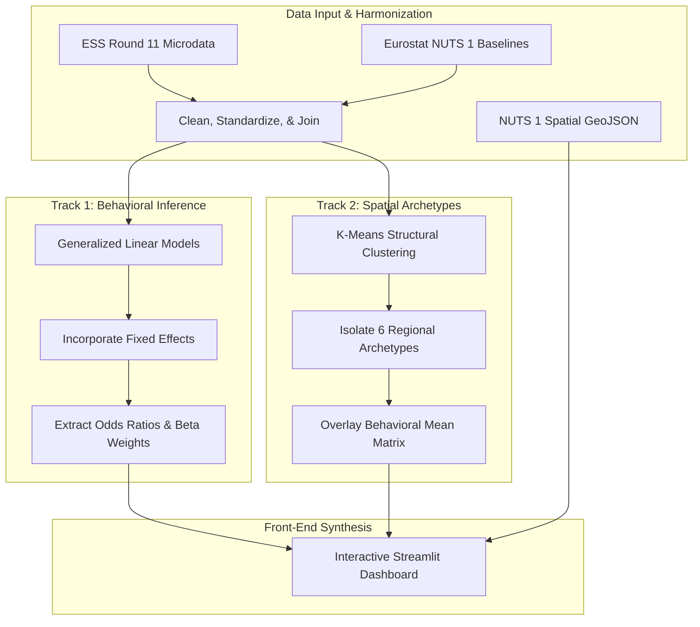

# The Geography of Discontent

A multi-level, multi-country empirical analysis investigating the intersections of regional macroeconomics, individual institutional trust, and radical-right voting behavior across Europe using European Social Survey (ESS) Round 11 microdata and Eurostat regional metrics.

---

## 1. Project Overview

This project investigates the multi-level drivers of radical-right voting behavior across European regions. 

The core premise is that electoral radicalization is not a simple byproduct of direct economic hardship. Instead, it occurs within a complex intersection of individual-level attitudes and localized regional dynamics. The project evaluates this phenomenon through two distinct analytical paths:
* **Behavioral Inference Modeling:** A fixed-effects Generalized Linear Model (GLM) calculating odds ratios to weigh the predictive power of individual values against regional environments.
* **Spatial Typologies:** A K-Means clustering approach that groups geographic regions purely by structural metrics, subsequently overlaying survey realities to discover how public sentiment aligns with structural conditions.

The project translates these findings into an interactive **Streamlit Dashboard Engine** designed to offer spatial insights for political scientists, public policy researchers, and electoral strategists.

---

## 2. Project Context

Public and media commentary on European populism frequently leans on uniform, sweeping narratives: the "globalization losers" thesis or uniform regional backlashes. 

This project operates at a finer spatial resolution (**NUTS 1 geographic aggregations**). By bridging individual microdata with regional macro-baselines, it explores whether citizens vote for the radical right because of their immediate regional economic surroundings, or if unobserved national baselines and deeper cultural/institutional trust deficits play the true defining role.

The foundational principle guiding this research is:
> Individual attitudes outweigh short-term economic macro shifts, yet national political histories anchor the absolute baseline likelihood of radical-right support.

---

## 3. Data Infrastructure & Scope

The analytical pipeline dynamically integrates and harmonizes individual-level survey microdata with localized macro-regional indicators across a **10-nation European framework**.

* **Survey Core Source:** European Social Survey (ESS) Round 11 (2023/2024 Integrated File, Edition 4.1)
* **Regional Structural Source:** Eurostat Regional Database (2024 Dataset Releases)
* **Spatial Geometry Engine:** Standardized NUTS 1 TopoJSON/GeoJSON boundary coordinates
* **Geographic Alignment Key:** Harmonized **NUTS 1 alphanumeric codes** (e.g., `DE1`, `FR1`) mapping individual respondents directly to their corresponding macro-economic environment.
* **Core Production Stack:** Python, Pandas, NumPy, Statsmodels (GLM Module), Scikit-Learn (K-Means Processing), Plotly Express & Graph Objects, and Streamlit.

---

### 3.1 Data Access & Local Replication Guide
To comply with data redistribution licensing agreements and maintain a lightweight open-source repository, **raw data files are explicitly omitted via `.gitignore`**. To locally run or replicate this dashboard environment, download the following source assets:

1. **ESS Microdata:** Download the full ESS Round 11 integrated file in SPSS (`.sav`) or CSV format via the official [ESS Data Portal](https://www.europeansocialsurvey.org/data/).
2. **Eurostat Macro Data:** Extract structural NUTS 1 metrics (regional GDP as a % of the EU average, standardized unemployment rates, and a 2-year delta for net migration) from the [Eurostat Database](https://ec.europa.eu/eurostat/data/database).
3. **Local Directory Alignment:** Save your raw downloads inside your local project space strictly following this structure:
   ```text
   └── data/
       ├── 1_raw/
       │   ├── ess_round11_raw.sav
       │   └── eurostat_nuts1_macro.csv
       └── 2_interim/

---

## 4. Key Variables & Dimensional Tiers

### 4.1 Outcome Focus
* **Primary Binary Dependent Variable:** Self-reported voting choice for a recognized radical-right political entity (`radical_right_vote`, mapped 0 or 1).
* **Composite Covariate:** Institutional Trust Index (`trust_index`), constructed by averaging evaluations of parliaments, politicians, and political parties.

### 4.2 Multi-Level Explanatory Structure

| Tier | Concept | Variable Input | Target Capture |
| :--- | :--- | :--- | :--- |
| **Regional Tier (Macro)** | Economic Performance | `gdp` | GDP per capita as a % of the European Union average |
| **Regional Tier (Macro)** | Labor Insecurity | `unemployment` | Standardized regional unemployment rates |
| **Regional Tier (Macro)** | Demographics | `migration` | Net migration window (calculated via a 2-year delta) |
| **Individual Tier (Micro)**| Institutional Trust | `trust_index` | Scale measuring composite trust in representative infrastructure |
| **Individual Tier (Micro)**| Identity / Culture | `immigration_attitudes`| Standardized evaluations regarding immigration impacts |
| **Individual Tier (Micro)**| Controls | `age`, `gender`, `education`| Demographic baseline balancing |

---

## 5. Analytical Pipeline

The architecture follows a multi-tiered pipeline that separates structural clustering from behavioral inference before synthesizing them inside the interactive front-end:



## 6. Central Hypotheses

* **H1: The Pure Economic Dissociation:** Regional economic deprivation alone is a weak predictor of radical-right support; affluent regions can record above-average support if accompanied by low institutional trust.
* **H2: Attitudinal Primacy:** Individual variations in institutional trust and immigration attitudes exert significantly stronger statistical signals (measured via GLM odds ratios) than regional macroeconomic indicators.
* **H3: National Boundary Baselines:** Unobserved national political contexts (captured via fixed-effects controls) anchor baseline voting thresholds that regional-level variations cannot fully override.

---

## 7. Methodology

### 7.1 Multi-Level Modeling (GLM)
The behavioral inference model runs logistic Generalized Linear Models (GLMs). It models the log-odds of a radical-right vote as a function of individual attributes, controlling for country-level fixed effects:

$$\log\left(\frac{P(Y_i = 1)}{1 - P(Y_i = 1)}\right) = \beta_0 + \beta_1(\text{Trust}_i) + \beta_2(\text{Macro}_\text{Region}) + \gamma(\text{Demographics}_i) + \delta_{\text{Country}}$$

Where $\delta_{\text{Country}}$ controls for unobserved national-level structural baselines.

### 7.2 Spatial Clustering & Behavioral Overlay
The spatial typology engine separates structural macro environments from political attitudes by utilizing a two-step approach:
1. **Unsupervised K-Means Clustering:** Iterates across the regional metrics (`gdp`, `unemployment`, `migration`) to define $K=6$ optimal structural clusters.
2. **Attitudinal Overlay Mapping:** Groups the underlying individual respondents by their region's assigned cluster and calculates the median behavioral outcomes (`trust_index`, `radical_right_vote`) to form a complete Structural and Behavioural Profile Matrix.

---

## 8. Selected Regional Typology Archetypes ($K=6$)

The spatial clustering engine identifies six distinct regional archetypes across the European canvas:
* **Economically Deprived Periphery:** Lower-than-average GDP, persistent labor market challenges, varying levels of political alienation.
* **Affluent Established Radical Right Presence:** Strong macroeconomic foundations and high regional wealth, paired with distinct cultural anxieties.
* **High Migration Low Backlash Regions:** Robust demographic influxes matched with resilient institutional trust profiles.
* **Vulnerable Battlegrounds:** Volatile economic metrics mixed with highly polarized attitudinal variances.
* **Alienated and Educated Skeptics:** High educational footprints but pronounced structural institutional trust deficits.
* **Status Quo Powerhouses:** Peak economic performance metrics with stable, highly resilient mainstream democratic support.

---

## 9. Key Dashboard Insights

* **The Hardship Paradox:** Economic deprivation does not automatically scale to radical-right support. Several highly affluent clusters record significant radical-right vote shares, while some of the most economically disadvantaged regions maintain baseline support profiles.
* **The Trust Premium:** Individual institutional trust levels and immigration attitudes consistently outperform regional macro factors—and out-predict direct local migration rates.
* **The Rigidity of Country Borders:** Fixed-effects coefficients indicate that national histories, specific party systems, and political traditions set rigid baseline probabilities across Europe that individual regional variations cannot fully alter.

---

## 10. Scope, Trade-offs & Limitations

* **The 3-Week Sprint Reality:** This entire research pipeline, data synchronization, econometric modeling, and visualization engine were completed within a strict three-week timeline.
* **Cross-Sectional Constraints:** The models evaluate cross-sectional survey snapshots. They capture predictive associations and odds ratios; they do not establish mathematical causality.
* **Geographic Border Friction:** While large NUTS 1 regions maintain robust survey sample sizes, they mask localized micro-nuances. Furthermore, single-region nations (such as Portugal and Finland) lack internal regional variation and were necessarily omitted from the internal fixed-effects modeling step.
* **Ballot Box Stigma:** Self-reported voting behavior for radical-right parties contains non-random missing data patterns stemming from social desirability bias and non-disclosures.

---

## 11. Running the Project

### 11.1 Installation
Install all required processing, visualization, and deployment frameworks:

```bash
pip install pandas numpy scipy statsmodels scikit-learn plotly streamlit
```
### 11.2 Launch the Front-End Dashboard

Execute the server locally from the root repository directory:

```bash
streamlit run app.py
```

## 12. Ethical & Interpretative Frame

* **No Normative Stigmatization:** This project serves as a descriptive and predictive analysis of political geography, not a normative evaluation of voters. It does not classify individual citizens or specific regions using pejorative or moralizing labels.
* **Analytical Archetypes vs. Real Groups:** The six regional typologies derived via K-Means clustering are exploratory statistical segments designed to unpack macro trends. They represent analytical models, not fixed, homogeneous social groups. 
* **Associational Bounds:** In alignment with rigorous econometric standards, all multi-level GLM outputs, odds ratios, and regional profiles are interpreted strictly as evidence-informed **predictive associations**, not deterministic or causal pathways. 
* **Accounting for Stigma:** The analysis explicitly acknowledges the non-random missingness often found in radical-right survey data, treating self-reported electoral choices as an approximation rather than an absolute baseline.