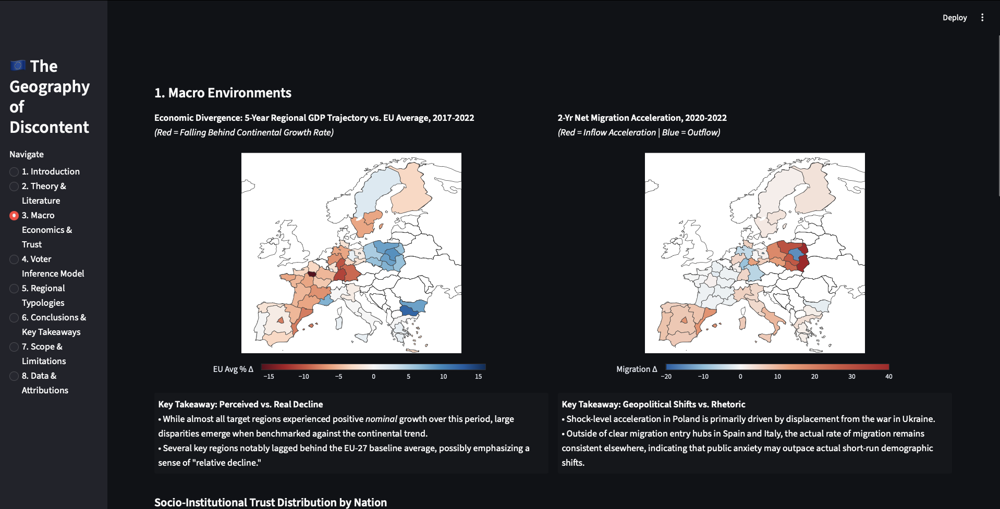
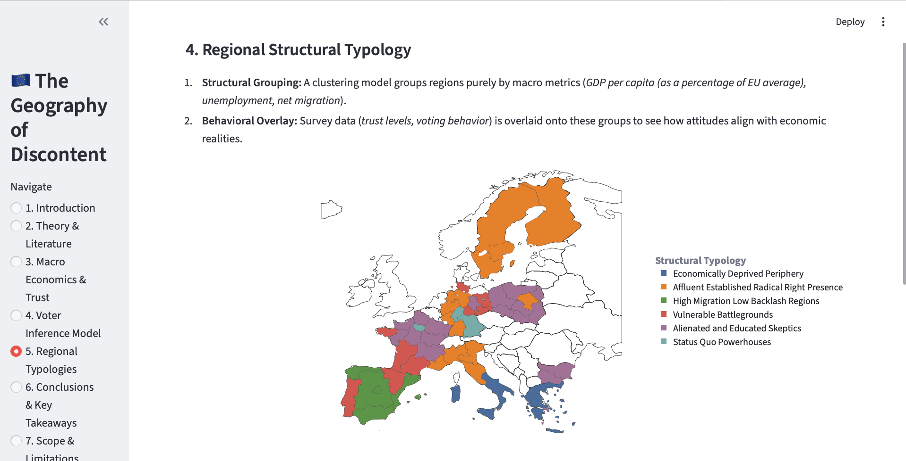

# The Geography of Discontent

An empirical analysis of radical-right voting across Europe, combining European Social Survey microdata with Eurostat regional indicators to evaluate the roles of economic conditions, individual attitudes, and national context.

---

## What This Project Does

Support for radical-right parties has increased across Europe, yet there is little consensus on why. Most public narratives on European populism rely on sweeping economic 
explanations — austerity, unemployment, globalization losers. This 
project tests those explanations empirically at the sub-national level 
(NUTS 1 regions) across 10 European countries, using two complementary 
analytical tracks:

- **Behavioral Inference:** A survey-weighted binomial GLM estimating 
  the individual-level predictors of radical-right voting, with country 
  fixed effects absorbing national baseline differences.
- **Spatial Typology:** K-Means clustering (K=6) of NUTS 1 regions on 
  structural macro indicators (GDP, unemployment, migration), with 
  attitudinal and behavioral outcomes overlaid to test how political 
  behavior maps onto economic environments.

Results are synthesized into an interactive Streamlit dashboard combining interactive maps, regional typologies, and statistical models into an exploratory interface for comparing political behaviour across Europe.

---

## Key Findings

- **Economic hardship is a weak predictor.** Some of the most 
  economically deprived regions in the dataset record below-average 
  radical-right vote shares, while several affluent clusters show 
  above-average support.
- **Attitudes outperform economic conditions.** Immigration attitudes 
  and institutional trust are the strongest individual-level predictors 
  of radical-right voting — stronger than regional GDP, unemployment, 
  or actual migration rates.
- **National context dominates.** Country fixed effects remain large 
  even after controlling for individual attitudes, suggesting that 
  party systems and political history set a baseline that 
  regional-level variation cannot fully override.
- **The migration paradox.** The cluster with the highest migration 
  acceleration returns the lowest radical-right vote share and the 
  most positive immigration attitudes — directly contradicting the 
  cultural threat hypothesis in its simple form.

---

## Data Sources

Raw data files are excluded from this repository per licensing 
requirements. To replicate locally:

**ESS Round 11 and multilevel companion data** — download the .csv files from the [ESS Data Portal](https://ess.sikt.no/en/).

Save files within your local project environment using this layout:

```text
geography_of_discontent/
└── data/
    ├── ESS11_main/
    │   └── ess_main_raw.csv
    └── ESS11_multilevel/
        ├── ESSMD2025_nuts1_e01_1.csv
        └── ess_region_lookup_file_raw.csv
```
---

## Tech Stack

Python · Pandas · NumPy · Statsmodels · Scikit-Learn · 
Plotly · Streamlit · dbt

---

## Running the Project

```bash
pip install pandas numpy scipy statsmodels scikit-learn plotly streamlit
streamlit run app.py
```

---
## Dashboard Preview



*Figure 1: The interactive Streamlit dashboard.*




*Figure 2: The regional clustering.*

---

## Scope & Limitations

- **Cross-sectional design:** Captures associations, not causal 
  pathways.
- **NUTS 1 aggregation:** Large regions mask local micro-variation; 
  Portugal and Finland (single NUTS 1 region each) are excluded from 
  fixed effects modeling.
- **Party classification:** Binary radical-right mapping draws on the 
  PopuList databae and academic consensus; borderline cases involve interpretive judgment.
- **Self-report bias:** Radical-right vote disclosure is subject to 
  social desirability effects and non-random missingness.

---

## Country Coverage

Germany · France · Italy · Spain · Poland · Sweden · 
Greece · Portugal · Finland · Bulgaria

---

## Note
This project examines statistical associations and should not be interpreted as making causal or normative claims about voters or regions.